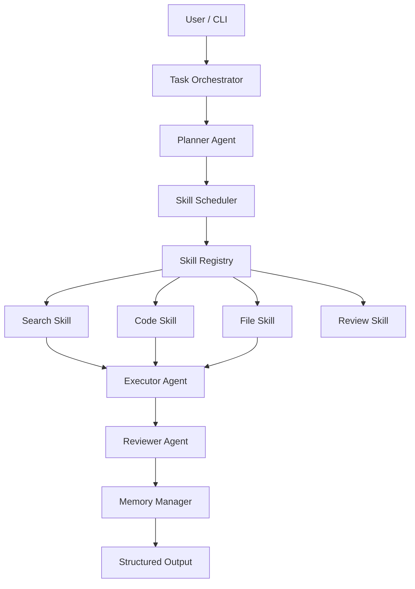

# AgentMesh 项目总览

## 一句话定位

AgentMesh 是一个 **多智能体协作与技能调度引擎**，用于把复杂任务拆解给多个具有独立记忆和角色能力的 Agent，并通过统一 Skill 调度机制完成可追踪、可复用、可扩展的自动化执行。

## 目标用户

- 需要构建 AI Agent 工具链的后端工程师。
- 希望学习多 Agent 编排、LLM Tool Calling、任务调度与插件化架构的开发者。
- 需要将研发、检索、代码审查、文档生成等任务自动化的个人或小团队。

## 项目边界

### 需要实现

- Agent 注册、加载、执行与状态维护。
- Agent 独立 Memory，包括短期上下文与长期摘要。
- Skill 注册表、输入输出 Schema、动态选择与调用。
- 多 Agent 协作流程，例如 Planner -> Executor -> Reviewer。
- CLI 操作入口，支持任务提交、执行观察和结果导出。
- Docker 化运行环境。

### 暂不优先实现

- 完整 Web 前端。
- 企业级权限系统。
- Kubernetes 生产集群。
- 大规模分布式调度。
- 自研向量数据库。

## 核心设计原则

1. **文档先行**：先明确产品、架构、Schema、模块边界，再进入代码。
2. **CLI 优先**：先做稳定命令行入口，降低 MVP 复杂度。
3. **模块可替换**：LLM Provider、Memory Store、Skill Executor 均通过接口抽象。
4. **结构化输出**：所有 Agent 与 Skill 的结果都可被程序继续消费。
5. **可观测执行**：每次任务拆解、Skill 调用、状态变更都写入事件日志。

## 核心流程

## 推荐 MVP 成功标准

- 支持至少 3 类 Agent 角色：Planner、Executor、Reviewer。
- 支持至少 5 个 Skill：planning、memory_search、file_io、code_runner、review。
- 支持至少 4 个 CLI 命令：agent create、task run、task status、memory show。
- 每个任务保留完整事件日志，包括 Agent 决策、Skill 调用、耗时与结果。
- 所有核心输入输出使用 Pydantic / dataclass Schema 约束。
- Docker 一条命令启动本地运行环境。

