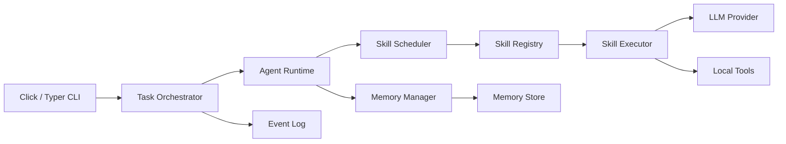
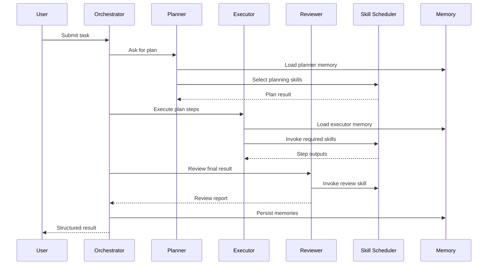

# AgentMesh 技术架构

## 1. 总体架构



## 2. 核心模块

### 2.1 CLI Layer

职责：

- 提供用户操作入口。
- 解析命令参数。
- 输出任务状态、事件日志和结构化结果。

推荐命令：

```bash
agentmesh agent create --name planner --role planner
agentmesh task run --agent planner --input "生成项目架构文档"
agentmesh task status --task-id task_001
agentmesh memory show --agent planner
agentmesh skill list
```

### 2.2 Task Orchestrator

职责：

- 创建任务。
- 分配 Agent。
- 维护任务状态机。
- 聚合 Agent 与 Skill 执行结果。
- 写入事件日志。

任务状态：

```text
created -> planning -> running -> reviewing -> completed
                         ↓
                       failed
```

### 2.3 Agent Runtime

职责：

- 加载 Agent Profile。
- 读取 Agent Memory。
- 调用 Skill Scheduler。
- 合并执行结果。
- 更新 Agent Memory。

Agent Profile 示例：

```json
{
  "agent_id": "agent_planner_001",
  "name": "planner",
  "role": "planner",
  "system_prompt": "你负责拆解复杂任务并生成执行计划。",
  "allowed_skills": ["planning", "memory_search", "task_split"]
}
```

### 2.4 Memory Manager

职责：

- 管理短期记忆：当前任务上下文、最近执行结果。
- 管理长期记忆：历史摘要、偏好、项目事实。
- 保障 Agent 之间记忆隔离。

MVP 存储建议：

- 本地 JSON：开发阶段简单可靠。
- SQLite：适合 MVP 持久化。
- Redis：后续用于短期状态缓存。
- FAISS / Chroma：后续用于长期语义检索。

### 2.5 Skill Registry

职责：

- 维护 Skill 元数据。
- 校验输入输出 Schema。
- 根据 Skill 名称或标签查询能力。
- 支持插件化扩展。

### 2.6 Skill Scheduler

职责：

- 根据任务类型、Agent 角色、Skill 标签选择合适 Skill。
- 编排多个 Skill 的调用顺序。
- 记录调用耗时、状态和错误。

MVP 策略：

1. 规则匹配：根据关键词、Agent role、allowed_skills 选择。
2. 标签过滤：根据 Skill tags 缩小候选集。
3. 固定流程：Planner -> Executor -> Reviewer。

扩展策略：

- LLM Router：让模型基于 Skill 描述选择工具。
- 历史效果评分：根据成功率和耗时选择 Skill。
- 多进程隔离：高风险 Skill 放入独立进程执行。

## 3. 多 Agent 协作流程



## 4. 并发模型

### asyncio

适合：

- LLM API 调用。
- 文件 IO。
- 多个轻量 Skill 并发执行。
- 任务事件流式输出。

### multiprocessing

适合：

- 隔离执行代码运行 Skill。
- CPU 密集型解析或批处理。
- 防止某个 Skill 阻塞主进程。

## 5. 部署形态

### MVP

```text
Local CLI + Local Storage + LLM API
```

### Docker

```text
Docker Container
├── AgentMesh CLI
├── Agent Runtime
├── Skill Modules
└── Local Volume: memories / task logs
```

### 后续服务化

```text
FastAPI Gateway
├── Agent Runtime Service
├── Skill Worker Service
├── Redis
├── PostgreSQL
└── Vector Store
```

