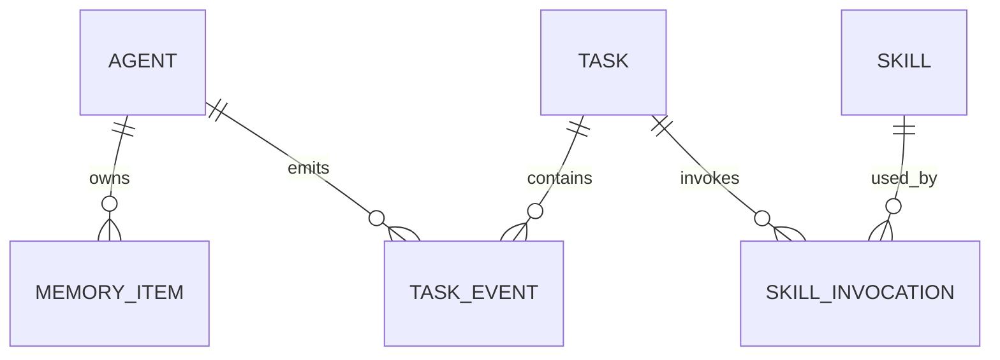

# AgentMesh 数据模型

## 1. 核心实体

## 2. Agent

| 字段 | 类型 | 说明 |
| --- | --- | --- |
| agent_id | string | Agent 唯一 ID |
| name | string | Agent 名称 |
| role | string | planner / executor / reviewer / custom |
| system_prompt | string | 角色提示词 |
| allowed_skills | list[string] | 可调用 Skill |
| status | string | active / disabled |
| created_at | datetime | 创建时间 |

## 3. Task

| 字段 | 类型 | 说明 |
| --- | --- | --- |
| task_id | string | 任务 ID |
| input | string | 用户输入 |
| status | string | 任务状态 |
| assigned_agents | list[string] | 参与 Agent |
| result | object | 最终结构化结果 |
| created_at | datetime | 创建时间 |
| updated_at | datetime | 更新时间 |

## 4. MemoryItem

| 字段 | 类型 | 说明 |
| --- | --- | --- |
| memory_id | string | 记忆 ID |
| agent_id | string | 所属 Agent |
| memory_type | string | short_term / long_term |
| content | string | 记忆内容 |
| metadata | object | 来源、标签、任务 ID |
| importance | float | 重要性评分 |
| created_at | datetime | 创建时间 |

## 5. Skill

| 字段 | 类型 | 说明 |
| --- | --- | --- |
| skill_name | string | Skill 名称 |
| description | string | 能力描述 |
| tags | list[string] | 调度标签 |
| input_schema | object | 输入 Schema |
| output_schema | object | 输出 Schema |
| safe_level | string | safe / controlled / isolated |
| enabled | bool | 是否启用 |

## 6. SkillInvocation

| 字段 | 类型 | 说明 |
| --- | --- | --- |
| invocation_id | string | 调用 ID |
| task_id | string | 所属任务 |
| agent_id | string | 发起 Agent |
| skill_name | string | 被调用 Skill |
| input | object | 调用输入 |
| output | object | 调用输出 |
| status | string | success / failed / timeout |
| duration_ms | int | 耗时 |
| error | string | 错误信息 |

## 7. TaskEvent

| 字段 | 类型 | 说明 |
| --- | --- | --- |
| event_id | string | 事件 ID |
| task_id | string | 任务 ID |
| agent_id | string | 可为空 |
| event_type | string | task_created / skill_invoked / memory_updated |
| payload | object | 事件内容 |
| created_at | datetime | 创建时间 |

## 8. MVP 存储策略

### 阶段一

- agents.json
- tasks.json
- memories/{agent_id}.json
- events/{task_id}.jsonl

### 阶段二

- SQLite 或 PostgreSQL 存储实体数据。
- Redis 存储运行中任务状态。
- FAISS / Chroma 存储长期记忆向量。

